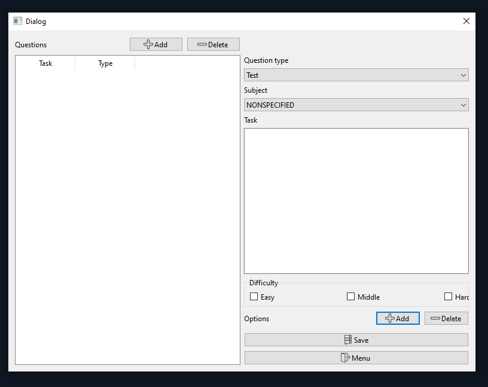
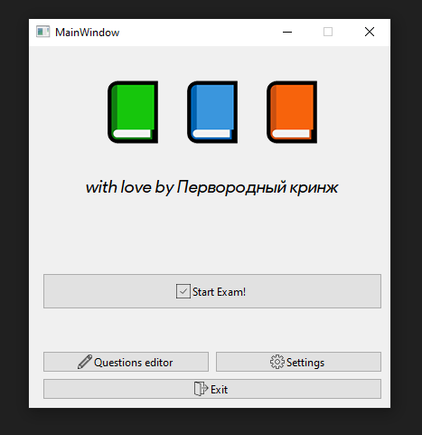
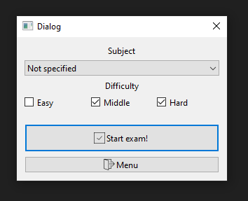
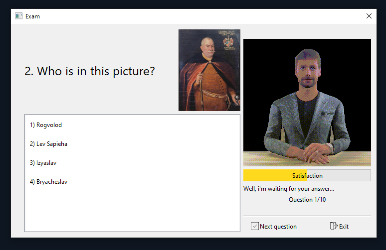
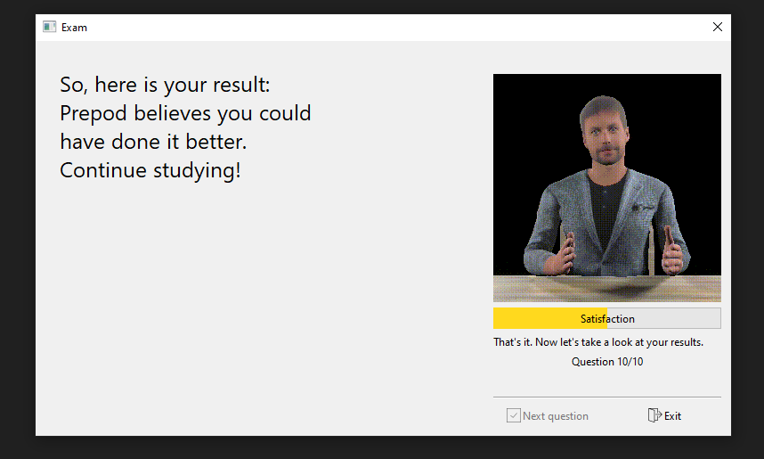

<!-- theme: uncover -->
<!-- backgroundImage: "linear-gradient(to right, #2dbb54, #6a9955)" -->
<!-- color: white -->

# Эмулятор экзамена 📗📘📙

Команда "Первородный кринж"

---
<!-- backgroundImage: "linear-gradient(to left, #5598d8, #96bfe7)" -->

# Концепция

- Приложение для подготовки к экзаменам
- Имеется развлекательный элемент

---

<!-- backgroundImage: "linear-gradient(to right, #5598d8, #96bfe7)" -->

# Детали решения

- Реализовали **тестовые** и **открытые** вопросы.
- Сделали редактор для них.
- Вопросы могут сопровождаться графикой.
- Вопросы разделили по **предметам** и **сложности**.
Так можно собрать нужный экзамен.

---

<!-- backgroundImage: "linear-gradient(to left, #5598d8, #96bfe7)" -->

# Детали решения

- Ответы пользователя оценивает препод :D
- Препод имеет шкалу удовлетворенности ответами. 
- ~~На оценку текстового ответа влияет его **смысл**.~~

---

<!--backgroundImage: "linear-gradient(to right, #2dbb54, #6a9955)"-->

# Редактор вопросов

---

<!--backgroundImage: "linear-gradient(to left, #2dbb54, #6a9955)"-->

# Визуал

Знакомьтесь, Препод.

---

<!--backgroundImage: "linear-gradient(to right, #2dbb54, #6a9955)"-->

# Интерфейс

---

<!--backgroundImage: "linear-gradient(to left, #2dbb54, #6a9955)"-->

# Интерфейс

---

<!--backgroundImage: "linear-gradient(to right, #2dbb54, #6a9955)"-->

---

<!--backgroundImage: "linear-gradient(to left, #2dbb54, #6a9955)"-->

---

<!--backgroundImage: "linear-gradient(to right, #2dbb54, #6a9955)"-->

---

<!-- backgroundImage: "linear-gradient(to left, #5598d8, #96bfe7)" -->

# Спасибо за внимание :)

